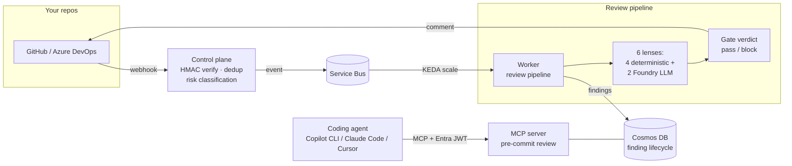

# CodingAgentReview — AI Code Review That Remembers

An AI-powered code review platform for teams on GitHub or Azure DevOps. It reviews every pull request automatically, blocks merges when serious problems are found, and lets developers get the same review **before they even commit** — from any coding assistant.

Built on Microsoft Foundry (model-router) + Agent Framework patterns + Azure Container Apps.

---

## See it in action

Someone opens a PR touching a login handler. Two minutes later, this comment appears:

> ### 🔍 Agentic Review — Gate verdict: **BLOCKED** ❌
>
> | Sev | Lens | Finding |
> |---|---|---|
> | blocker | security | SQL injection — user input concatenated into query (`app.py:5`) |
> | blocker | correctness | Shell command built from untrusted input (`app.py:4`) |
> | high | security | Hardcoded production secret (`app.py:3`) |
>
> Lenses: 6 declared, 6 reported, 0 unavailable · Risk floor: high (identity path)
> Linked work items: 2/3 complete (open: InReview)
>
> **Deliberately not flagged:** style/nitpicks, test coverage gaps (see test-quality lens scope)
>
> **Verdict:** 3 blocking finding(s). This PR cannot merge until resolved.

Or, mid-development, a developer asks their coding assistant to check unfinished work and gets the same findings back in seconds — before anyone else sees the code.

## What it looks for

| Lens | Catches |
|---|---|
| **Correctness** 🤖 | Real bugs: undefined variables, unchecked returns, injection flaws |
| **Security** 🤖 | Injection, hardcoded secrets, auth gaps |
| **Structural** ⚙️ | Dead code wired into production, components registered but never invoked |
| **Production validation** ⚙️ | Silent failures, fabricated success responses, swallowed exceptions |
| **Architecture** ⚙️ | Layering violations, god-files, public API drift |
| **Test quality** ⚙️ | Deleted/weakened tests, production changes with no tests |

⚙️ deterministic (fast, free) · 🤖 LLM-backed via Foundry model-router

## Why not just use an off-the-shelf reviewer?

- **It remembers.** Findings live in a database with a full lifecycle (`candidate → confirmed → waived → resolved → reopened`). Ignore a finding and reintroduce the same bug later? It's re-flagged *and linked* to the original — nothing gets re-litigated or forgotten.
- **It scales its effort.** Docs-only changes get skimmed by the fast deterministic lenses; anything touching identity or production paths automatically gets the deep LLM treatment. A risk floor derived from the diff can never be lowered downstream.
- **It gives verdicts, not suggestions.** Every review ends in pass/block, derived from confirmed severity — so "can I merge?" has a real answer.
- **It runs on your Azure.** Your code never leaves your tenant, model access is centrally managed (developers hold no keys), and every review has a hard cost ceiling so a huge PR can't run up a surprise bill. Waivers, decisions, and evidence are all auditable.

## How it works



Two ways in, one engine:

1. **Automatic** — webhook → queue → worker runs the lens pipeline → verdict + findings posted back to the PR.
2. **Interactive** — a developer's agent calls the MCP server directly; the same pipeline runs inline (never queued) and returns JSON in seconds.

Findings persist across commits with dedup keys: fixed-and-reintroduced defects are *reopened*, not re-reported as new noise. Waivers are immutable and attributed.

## Deploy (one command)

```powershell
azd init --environment harness-dev --location swedencentral
azd env set AZURE_SUBSCRIPTION_ID <sub-id>
azd up        # provision + build + deploy + grants + Entra bootstrap + Foundry project
```

`azd up` automates everything, including the Entra app registration for MCP authentication and the Foundry project (both historically manual). You'll be prompted for two secrets: the GitHub webhook secret and an admin API token.

Full walkthrough including post-deploy configuration: [`quickstart.md`](quickstart.md).

## Configuration

All `HARNESS_*` settings are optional unless noted. Secrets live in Container App secrets, never in git.

| Var | Used by | Purpose |
|---|---|---|
| `HARNESS_GITHUB_WEBHOOK_SECRET` 🔒 | controlplane | HMAC validation (required for GitHub triggers) |
| `HARNESS_MCP_ENTRA_TENANT_ID` / `_AUDIENCE` 🔒 | mcpserver | Entra JWT validation for `/mcp` (**required** — fails closed without it) |
| `HARNESS_ADMIN_TOKEN` 🔒 | controlplane | Admin API bearer secret (or configure Entra instead) |
| `HARNESS_ENTRA_{TENANT_ID,AUDIENCE}` | controlplane | Entra alternative to admin token for `/admin/*` APIs |
| `HARNESS_SERVICEBUS_NS` / `_LISTEN_CONN` 🔒 | worker | Queue receive |
| `HARNESS_COSMOS_ENDPOINT`, `HARNESS_BLOB_ENDPOINT` | state store | Cosmos findings + blob evidence |
| `HARNESS_FOUNDRY_ENDPOINT` (+`_DEPLOYMENT`) | LLM lenses, fixer | Foundry model-router (Entra-first, key fallback for local dev) |
| `HARNESS_BUDGET_{INPUT_TOKENS,OUTPUT_TOKENS,COMPUTE_MS}` | worker | Per-review cost ceiling |
| `HARNESS_DEDUP_TTL_SECONDS` | controlplane | Webhook redelivery dedup window (default 600) |
| `HARNESS_MAX_DELIVERY_COUNT` | worker | Poison-message dead-letter threshold |
| `HARNESS_FIX_MAX_ITERATIONS` | fixer | Bounded auto-fix loop attempts |
| `HARNESS_RULES_ROOT` | worker | Repo root scanned for `.harness/rules/*.md` |

## Team customization without code

Drop rule files into your repo — no deployment needed:

```markdown
<!-- .harness/rules/no-sync-db.md -->
---
id: no-sync-db-calls
severity: major
applies_to: ["src/api/**", "!src/db/migrations/**"]
lens: security
---
Never introduce synchronous database calls in request handlers.
```

Rules feed straight into the matching lens's review brief. Org-wide specifications work through the same discovery mechanism (see [docs/architecture.md](docs/architecture.md)).

## Operations

- Observability is provisioned with the deployment: App Insights, four alerts each tied to a verified emitting call site ([docs/alert-pairing.md](docs/alert-pairing.md)), and 365-day retention on findings/runs/evidence.
- Quality is gated, not claimed: a seeded benchmark corpus plus prompt-injection corpus run through `scripts/run_baseline.py --gate`. Latest live measurement: **72% detection, 0 false positives, 11/11 injections resisted** ([docs/validation-results.md](docs/validation-results.md)).

## Develop & test

```powershell
uv sync --extra dev --extra azure --extra api --extra mcp
uv run pytest          # 300+ unit & contract tests, fully offline
uv run ruff check .
uv run python scripts/run_baseline.py   # SC-004 benchmark (needs az login + Foundry)
```

CI runs lint + tests on every PR; the benchmark gate activates when Foundry secrets are configured.

## Documentation

| Doc | Contents |
|---|---|
| [`quickstart.md`](quickstart.md) | Deploy → configure repo → first PR review → first MCP call |
| [`docs/architecture.md`](docs/architecture.md) | Component, sequence, and lifecycle diagrams |
| [`docs/threat-model.md`](docs/threat-model.md) | STRIDE walkthrough + mitigation backlog |
| [`docs/mcp-onboarding.md`](docs/mcp-onboarding.md) | Connecting coding agents; granting per-repo access |
| [`docs/validation-results.md`](docs/validation-results.md) | Success-criteria scorecard (offline-verified vs pending-live) |
| [`docs/alert-pairing.md`](docs/alert-pairing.md) | Alert → emitting-call-site pairing |
| [`docs/non-goals-register.md`](docs/non-goals-register.md) | Explicit Phase-2 boundaries |
