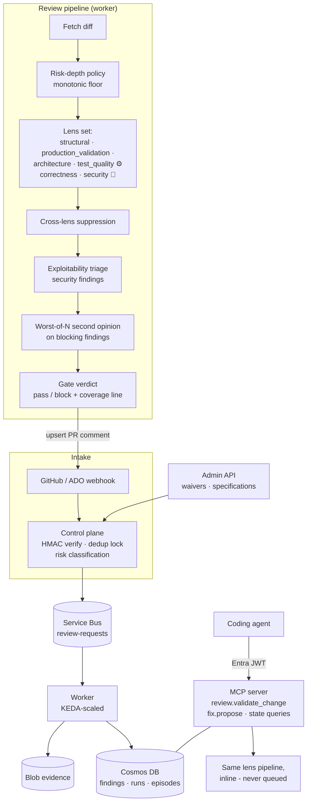
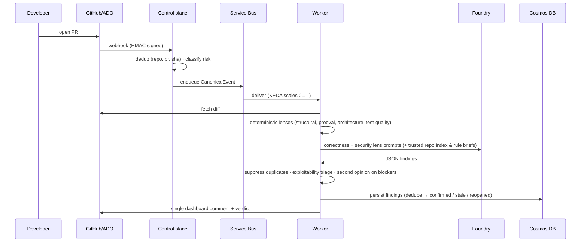
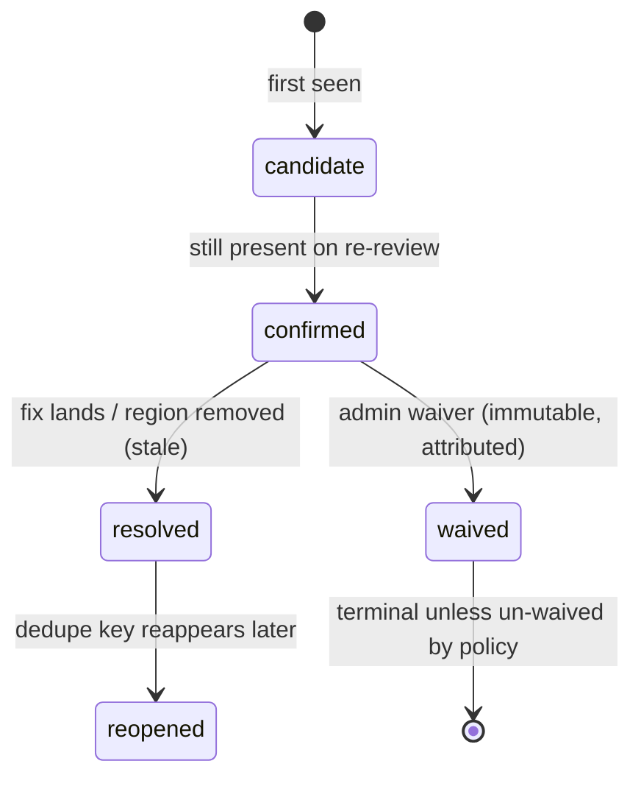

# Architecture

The harness reviews code changes through composable lenses and keeps every finding in a durable, auditable lifecycle.

## Component view

## Sequence: automatic PR review

## Finding lifecycle

- **Dedupe keys** (`path` + normalized content hash) identify "the same problem" across commits.
- **Reopen** links a reintroduced finding back to its original — history is never rewritten.
- **Waivers** are enforced immutable at both the state-machine and repository layers.

## Trust boundaries

| Input | Treatment |
|---|---|
| Diff content | Untrusted data — prompt-injection attempts are themselves findings |
| `.harness/rules/*.md`, org specs | Trusted maker-authored context (version-controlled in the repo) |
| Repo symbol index | Trusted generated context, bounded and labeled before entering prompts |
| Webhooks | HMAC-verified; redelivery-deduped |
| MCP requests | Entra JWT (JWKS-pinned), repo-scoped via `repos` claim or app roles |

Deterministic enforcement (auth, tenancy, budgets, dead-lettering) lives outside the prompts — instructions are defence-in-depth only.

## Key source map

| Area | Path |
|---|---|
| Domain models & lifecycle | `src/harness/` |
| Lenses | `src/lenses/` |
| Review orchestration | `src/worker/` |
| Providers (GitHub, Azure DevOps) | `src/providers/` |
| Webhook intake + admin API | `src/controlplane/` |
| MCP server | `src/mcpserver/` |
| Spec/rule discovery & applicability | `src/graph/` |
| Benchmark & scoring | `src/eval/`, `benchmark/` |
